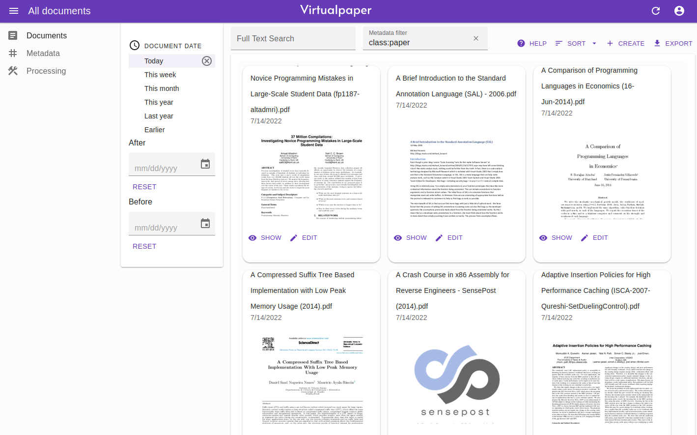

# Virtualpaper



Virtualpaper is a text document management solution, featuring automatic content extraction and 
powerful search for all content. Documents are not stored in hierarchical directories, instead it relies
on completely user-editable key-value metadata. Think of it as not having a single hierarchy, but as many views to 
documents as you wish: 
* List all invoices from last year
* List all documents from company x
* List all documents related to a project
   
If you wish to benefit from this kind of filtering, you need to assign at least a few of these meaningful 
metadata-values. To help automate this, 
Virtualpaper tries to automatically match these values from document content when indexing them. 
In addition to filtering content according by metadata, Virtualpaper features full-text-search powered by Meilisearch,
which covers all metadata as well as content of the document itself.

This project is a **work-in-progress**.

## Features
* Store text documents (pdf, image files are extracted for text content)
* Save any key-value metadata to documents
    * If configured, try to match key-values automatically from documents
    * Detect document date
* REST api (swagger documentation is located at api/swaggerdocs/swagger.json) or at <virtualpaper-instance>/api/v1/swagger.json
* Full-text-search
* **Total number of users is limited to 200.** This is because Meilisearch has a limit of 200 indices, and each user
uses one index. The benefit for own index is that each user can now configure their personal settings: 
  synonyms, stop words and results ranking, thus users have more powerful search capability over their files.
  Maybe one day it is possible to have more users, though.


## Requirements
Required 3rd party applications (run in docker, host, or another host machine):
* Postgresql
* Meilisearch v0.25.2

Create postgresql database and make sure to **initialize database as utf8** with e.g.: 
```CREATE DATABASE virtualpaper WITH ENCODING='utf8' TEMPLATE template0;```

Meilisearch does not require configuration other than from security perspective: consider setting apikey
and mode to production, and configure Virtualpaper accordingly. 
Meilisearch only indexes first 1000 words per document, which means that long documents
are not fully searchable by their content. 

# Building

## Server
You need Go 1.16 or later installed and configured.

In addition, you need Tesseract with headers and Imagemagick-v7. 
See Dockerfile for more info. Some distributions (e.g. Debian) ship Imagemagick-v6 by default. 
It is recommended to install ```poppler-utils``` for getting reliable results on pdfs that contain text (and not images).
Also ```pandoc``` is recommended.
Please configure the locations for these executables in the configuration file. 

Build server with:
```make build```

## Frontend

Frontend is built with React and great React-Admin framework.
Make sure nodejs, npm and yarn are installed and then:

Initial configuration:
```cd frontend; yarn install```

Build frontend with:
```make build-frontend```


# Configuration
Copy config.sample.toml to config.toml and place it to ~/.virutalpaper.toml.

Fill database and meilisearch configuration and you're good to go, at least for testing purposes.
All content is stored in filesystem, which is defined in config-file: Processing.data_dir.

All configuration variable can be overridden with environment variables, e.g.:
```VIRTUALPAPER_PROCESSING_DATA_DIR="/data"``` or
```VIRTUALPAPER_MEILISEARCH_URL="http://meilisearch:7700"```


# Run
Virtualpaper can be run directly or with docker. 
Docker is easiest to get started with.

## Docker

The easiest way to get started is by using the provided docker-compose file:
```
docker-compose up
```

copy config.sample.toml to e.g. config-dir/config.toml.

By default, docker file includes only English-dataset for tesseract OCR engine. To use other languages,
either include them in docker file, or install language packages on host machine and add them as volume to docker
with: ```-v /usr/share/tessdata:/usr/share/tessdata```. Host machine location may vary depending on distribution used.

Start server (for testing):
```docker run -d -v /config-dir:/config/ tryffel/virtualpaper:latest serve```

Start server (for persistence):
```
docker run -d \
    -v /config-dir:/config/ \
    -v /virtualpaper-data:/data \
    -v /virtualpaper-logs:/logs \
    tryffel/virtualpaper:latest serve
```

Create new user:
```
docker run -it \
    -v /config-dir:/config/ \
    -v /virtualpaper-data:/data \
    -v /usr/share/tessdata:/usr/share/tessdata \
    tryffel/virtualpaper:latest manage add-user
```

Reset password:
```
docker run -it \
    -v /config-dir:/config/ \
    -v /virtualpaper-data:/data \
    -v /usr/share/tessdata:/usr/share/tessdata \
    tryffel/virtualpaper:latest manage reset-password
```

## Manually
```virtualpaper --config config.toml serve```

# Usage

1. Create user with command 'manage add-user'.
2. Head over to web page, which is by default at http://localhost:8000 and login
3. Add some metadata key values. These are application-specific, but some initial keys might be
'correspondent', 'class', 'state', 'project' and fill some values for these. 
4. Upload documents on web page, let server index them and search for some documents.

# Development


Start frontend in development mode:
```make run-frontend```

Start backend:
```make run```

Spin up a development stack:
```make test-start```

Stop development stack:
```make test-stop```

## Tests (backend):

Unit tests:
```make test-unit```

Integration tests:
```make test-integration```

End-to-end tests (requires running server instance):
```make test-e2e```
e2e-tests communicate with the actual server and thus needs a working connection.
Before running e2e tests, start the server with ```make test-start```.
Also be sure the cleanup the server environment before running the e2e tests: ```make test-stop```.

All tests:
```make test```

